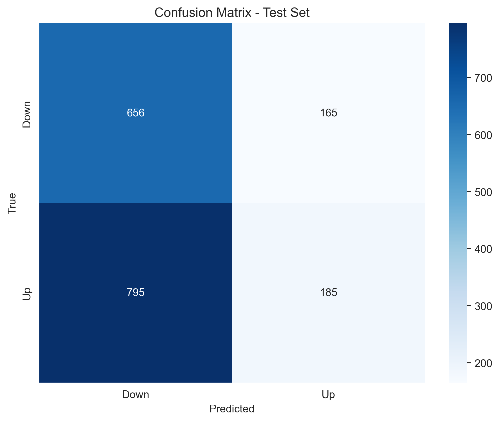
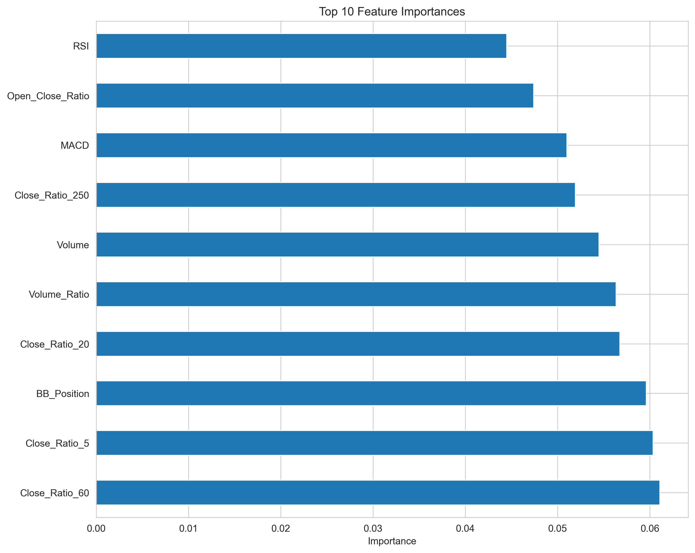
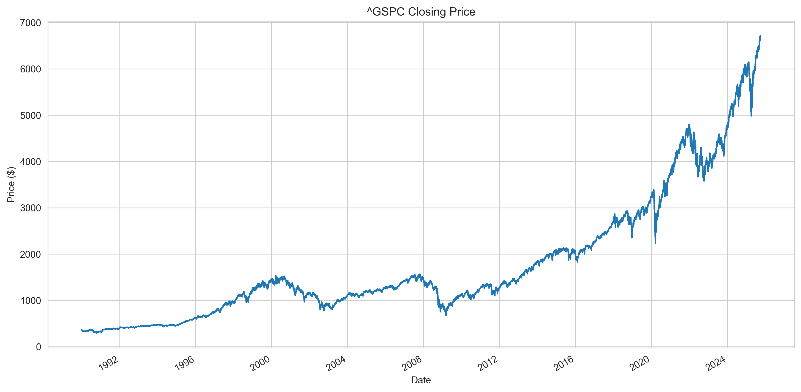

# 📈 Stock Price Direction Predictor

**Predict the next day’s stock price movement** (Up/Down) using historical data and machine learning.
Built with **Python**, **scikit-learn**, **yFinance**, and **technical indicators**, featuring an **interactive Streamlit app** for exploration and visualization.

---

## 🔑 Key Features

* Fetches historical stock data from **Yahoo Finance** or cached CSV.
* Computes **technical indicators manually** (RSI, MACD, Bollinger Bands, moving averages, etc.).
* Applies **time-series aware training** (avoiding lookahead bias).
* Trains a **Random Forest Classifier** with **grid search hyperparameter tuning**.
* Provides **evaluation metrics**: precision, recall, F1-score, ROC-AUC, and confusion matrix.
* Supports **backtesting** over historical data to validate performance.
* Interactive **Streamlit app** for experimenting with tickers and prediction horizons.

---

## 📂 Project Structure

```
stock-predictor/
├── stock_predictor.py        # Main ML pipeline
├── predict_new.py            # Predict recent/new data
├── app.py                    # Streamlit web app
├── requirements.txt          # Python dependencies
├── sp500.csv                 # Cached S&P 500 data
├── stock_predictor_model.pkl # Saved trained model
├── plots/                    # Generated plots (feature importance, confusion matrix, etc.)
├── screenshots/              # Streamlit UI screenshots
└── README.md
```

---

## ⚙️ Installation

Clone the repository and install dependencies:

```bash
git clone https://github.com/Sagarika311/stock-predictor.git
cd stock-predictor
pip install -r requirements.txt
```

---

## ▶️ Usage

### 1. Run the ML pipeline

```bash
python stock_predictor.py
```

This will:

* Fetch historical stock data (default: **S&P 500**) or use cached CSV.
* Train the model and evaluate its performance.
* Backtest predictions on historical data.
* Save plots in `/plots`.
* Save the trained model as `stock_predictor_model.pkl`.

**Sample Test Set Metrics:**

```
Precision: 0.68
Recall:    0.54
F1-Score:  0.60
Accuracy:  0.62
ROC-AUC:   0.65
```

---

### 2. Quick Predictions on Recent Data

Use `predict_new.py` to generate predictions for the **last N days** without running the full pipeline:

```bash
python predict_new.py
```

* Default: predicts for the **last 5 trading days**.
* Outputs a table with:

  * Date
  * Closing Price
  * Predicted Direction (Up/Down)
  * Probability of an Up day

**Example Output:**

```
 Date       Close  Predictions  Probability_Up
2025-09-26  4500        1           0.78
2025-09-27  4525        0           0.43
2025-09-28  4510        1           0.65
2025-09-29  4528        1           0.81
2025-09-30  4540        0           0.55
```

*Note: Model must exist (`stock_predictor_model.pkl`). Otherwise, run `stock_predictor.py` first.*

---

### 3. Launch the interactive Streamlit app

```bash
streamlit run app.py
```

### 📸 Streamlit UI Screenshots

Interactive UI preview of the app:

**Streamlit UI - View 1**
.png)

**Streamlit UI - View 2**
.png)

**Streamlit UI - View 3**
.png)

**Streamlit UI - View 4**
.png)

*Shows tables of predictions, closing price charts, and interactive controls for exploring different tickers and prediction horizons.*

---

## 📊 Example Outputs

**Confusion Matrix**


**Feature Importance**


**Closing Price Trend**


---

## 🚀 Deployment

Deploy easily using **Streamlit Cloud**:

1. Push your repo to GitHub.
2. Visit [share.streamlit.io](https://share.streamlit.io/), connect your repo, and deploy.

Alternative hosting: **Render** or **Heroku** for Flask/FastAPI APIs.

---

## 🔮 Future Improvements

* Add support for additional ML models (XGBoost, CatBoost, LSTM).
* Enhance backtesting with **portfolio/trading strategy simulation**.
* Integrate **fundamental analysis** and **sentiment indicators**.
* Deploy a **live daily predictor** (cron job with email/Telegram alerts).

---

## 📌 Disclaimer

⚠️ **For educational purposes only.**
This project **does not constitute financial advice**. Predictions are experimental and **should not be used for real trading decisions**.

---

## 👩‍💻 Author

**Sagarika**
GitHub: [Sagarika311](https://github.com/Sagarika311)

---

## 📊 Portfolio Summary Script (`portfolio_summary.py`)

`portfolio_summary.py` provides a **comprehensive visual summary** of your stock prediction model for a given ticker. It combines historical prices, feature importance, and recent predictions into an easy-to-interpret set of plots.

### 🔹 Features

* Loads the **trained model** and associated predictors.
* Fetches the **latest stock data** from Yahoo Finance (or uses cached CSV data).
* Computes **technical indicators**: moving averages, RSI, MACD, Bollinger Bands, etc.
* Plots **historical closing prices** for context.
* Visualizes **feature importance** to see which indicators influence predictions most.
* Predicts **next N days** of stock movement (Up/Down).
* Generates a **combined summary figure** showing closing price, feature importance, and latest predictions.

### ⚙️ How to Run

1. Ensure your Python environment has the required packages:

```bash
pip install -r requirements.txt
```

2. Make sure the **trained model** exists:

```bash
python stock_predictor.py
```

3. Run the portfolio summary:

```bash
python portfolio_summary.py
```

4. Check the **plots folder** for outputs:

* Historical closing price: `closing_price.png`
* Feature importance: `feature_importance.png`
* Latest predictions: `predictions_<TICKER>_latest_<N>_days.png`
* Combined summary figure: `<TICKER>_summary.png`

### 🔹 Customization

* Change the ticker or number of days to predict by editing:

```python
TICKER = "^GSPC"  # Example: "^GSPC" or "AAPL"
N_DAYS = 5        # Number of latest days to predict
```

* All plots are **saved locally** in the `plots/` folder.

### ⚠️ Notes

* This script is **offline-ready** once CSV datasets and trained models exist.
* Provides **visual insights** into model behavior and predictions — ideal for portfolio analysis and reporting.

---

## 📄 Portfolio Report Script (`portfolio_report.py`)

`portfolio_report.py` generates a **comprehensive PDF report** summarizing your stock prediction model’s performance and insights for a given ticker. It combines historical price charts, feature importance, predictions, and evaluation metrics into a single, easy-to-share PDF.

### 🔹 Features

* Loads the **trained RandomForest model** and associated predictors.
* Fetches the **latest stock data**.
* Computes **technical indicators** such as moving averages, RSI, MACD, Bollinger Bands, etc.
* Plots:

  * Historical closing prices
  * Feature importance of predictors
  * Latest predictions for the next N trading days
* Evaluates the model on the **last 20% of data** and reports metrics (accuracy, precision, recall, etc.).
* Compiles all visuals and metrics into a **PDF report** for easy sharing or portfolio analysis.

### ⚙️ How to Run

1. Ensure your Python environment has the required packages:

```bash
pip install -r requirements.txt
```

2. Make sure the **trained model** exists:

```bash
python stock_predictor.py
```

3. Run the portfolio report script:

```bash
python portfolio_report.py
```

4. The **PDF report** will be saved in the `plots/` directory:

```text
plots/<TICKER>_portfolio_report.pdf
```

### 🔹 Customization

* Change the ticker or number of days to predict:

```python
TICKER = "^GSPC"  # Example: "^GSPC" or "AAPL"
N_DAYS = 5        # Number of latest days to predict
```

* Modify the **model evaluation split** or thresholds directly in the script if needed.

### ⚠️ Notes

* The script automatically generates and saves plots for the PDF report.

* The PDF includes:

  * Historical closing price chart
  * Feature importance chart
  * Latest predictions chart
  * Model evaluation metrics table

* Ideal for **portfolio reporting**, performance review, or sharing predictive insights with stakeholders.

---

